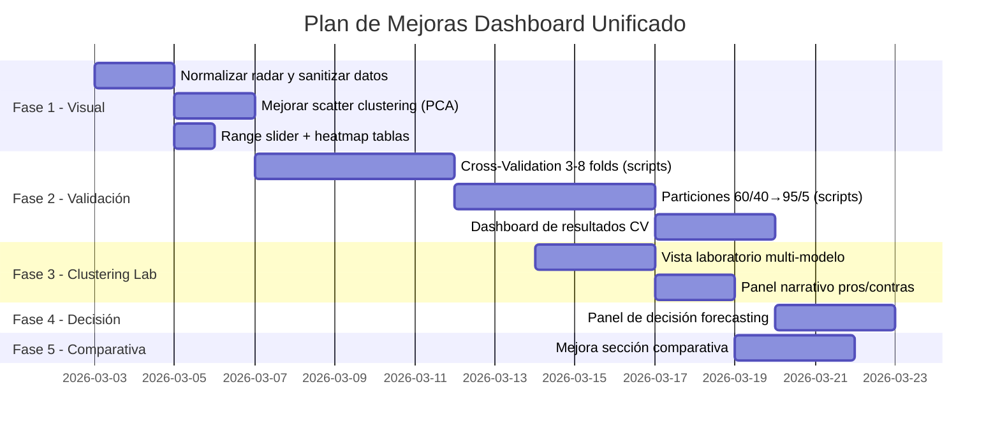

# 🔬 Plan de Mejoras — Dashboard Unificado BCIE ML Lab

**Fecha de Auditoría:** 2 de Marzo, 2026 — 05:57 CST  
**Auditor:** Norman Sabillón (asistido por Antigravity AI)  
**Archivo:** `app/data/gold/dashboard/dashboard_unificado.html`  
**Versión Actual:** v2.0.0

---

## 📋 Resumen Ejecutivo

Esta auditoría evalúa el estado visual, técnico y funcional del Dashboard Unificado — la pantalla principal que consolida los modelos de **Forecasting** (4 modelos) y **Clustering** (7 modelos) del laboratorio ML del BCIE. El objetivo es proponer mejoras que transformen el dashboard de un "visor de datos" a una **herramienta de toma de decisiones**.

> [!IMPORTANT]
> **Principio rector:** No se elimina nada existente. Todo se mejora o se complementa con nuevas secciones.

---

## 🖼️ Auditoría Visual — Estado Actual

### Capturas de pantalla de cada sección:

````carousel

<!-- slide -->

<!-- slide -->

````

---

## 🔴 Hallazgos Críticos por Sección

### 1. Pantalla de Inicio ✅ (Te Encanta — Sugerencias Menores)

| # | Hallazgo | Severidad | Sugerencia |
|---|----------|-----------|------------|
| I-1 | Los KPIs son excelentes y el layout Bento está profesional | ✅ OK | Mantener tal cual |
| I-2 | La tabla anual muestra bien el detalle | ✅ OK | Agregar mini-sparklines dentro de la tabla |
| I-3 | El gráfico de evolución temporal parte desde 1961 | 🟡 Menor | Agregar un range slider para zoom temporal |
| I-4 | Los donuts de sector están bien | ✅ OK | Mantener |
| I-5 | Barras de país bien resueltas | ✅ OK | Considerar agregar banderitas junto al nombre |

> [!TIP]
> **La pantalla de Inicio está bien lograda.** Solo sugerencias cosméticas menores como sparklines y un range slider.

---

### 2. Sección de Forecasting 🔴 (Crítico — Necesita Restructuración Completa)

| # | Hallazgo | Severidad | Propuesta de Mejora |
|---|----------|-----------|---------------------|
| FC-1 | **Gráfico temporal comprimido:** La escala 1960-2030 aplana toda la serie histórica, el pronóstico aparece como "salto" vertical | 🔴 Crítico | Zoom automático a últimos 20 años + data anterior como contexto suave |
| FC-2 | **Sin métricas de accuracy:** No hay MAPE, RMSE, MAE, R² para comparar modelos | 🔴 Crítico | Agregar tarjetas de métricas para cada modelo |
| FC-3 | **Sin Cross-Validation:** No se puede evaluar la estabilidad del pronóstico | 🔴 Crítico | **NUEVO: Sección de Cross-Validation (3-8 folds)** |
| FC-4 | **Sin experimentación de particiones:** No se varía la proporción train/test | 🔴 Crítico | **NUEVO: Sección de Particiones (60/40 → 95/5)** |
| FC-5 | **No se puede decidir cuál modelo es mejor:** Falta comparativa side-by-side | 🔴 Crítico | **NUEVO: Panel de Decisión "¿Qué modelo usar?"** |
| FC-6 | Los tabs funcionan bien para cambiar modelo | ✅ OK | Mantener |
| FC-7 | La tabla de pronósticos por país es útil | ✅ OK | Agregar heatmap de color por intensidad |
| FC-8 | Las tarjetas de trayectoria lateral son correctas | 🟡 Menor | Mejorar formato de porcentajes extremos (+123052%) |

---

### 3. Sección de Clustering 🔴 (Crítico — Gráficos Inservibles)

| # | Hallazgo | Severidad | Propuesta de Mejora |
|---|----------|-----------|---------------------|
| CL-1 | **Scatter plot bidimensional horrible:** Eje Y es "Cantidad" (valores 1-2), todos los puntos se alinean en 2 líneas | 🔴 Crítico | Cambiar a PCA/t-SNE 2D scatter con clusters coloreados |
| CL-2 | **"?" en el número de clusters:** No se muestra K real | 🔴 Crítico | Extraer K de métricas y mostrarlo |
| CL-3 | **Mucho espacio vacío debajo del gráfico** | 🟡 Medio | Agregar panel de interpretación, distribución por cluster |
| CL-4 | **Sin resumen textual:** No explica qué significa cada cluster | 🔴 Crítico | Agregar "Perfil del Cluster" con descripción narrativa |
| CL-5 | **Sin vista comparativa lateral:** Solo un modelo a la vez | 🟡 Medio | **NUEVO: Vista side-by-side de todos los clústerings** |
| CL-6 | **Falta tabla de distribución:** ¿Cuántos países/operaciones por cluster? | 🔴 Crítico | Agregar tabla de composición por cluster |

---

### 4. Sección de Comparativa 🔴 (Crítico — Radar Distorsionado)

| # | Hallazgo | Severidad | Propuesta de Mejora |
|---|----------|-----------|---------------------|
| CP-1 | **Radar chart aplastado:** MIXED tiene Calinski=2873 vs ~433 del resto, distorsiona todo | 🔴 Crítico | Normalizar todas las métricas a escala 0-1 |
| CP-2 | **"nan" en estabilidad de MIXED** | 🔴 Crítico | Mostrar "N/A" y explicar por qué |
| CP-3 | **"—" en columna K:** No muestra el número de clusters | 🟡 Medio | Llenar con K real de cada modelo |
| CP-4 | **Sin redacción de pros/contras:** No hay análisis textual | 🔴 Crítico | Agregar panel narrativo "¿Cuál es mejor y por qué?" |
| CP-5 | **Solo compara clustering, no forecasting** | 🟡 Medio | Agregar comparativa de modelos de forecasting |

---

## 🏗️ Plan de Implementación

### Fase 1: Correcciones Visuales Inmediatas *(Prioridad: ALTA)*

> [!NOTE]
> Estas correcciones no requieren re-ejecución de modelos, son puramente de presentación.

| Tarea | Archivo | Esfuerzo | Detalle |
|-------|---------|----------|---------|
| **1.1** Normalizar radar chart (0-1) | `dashboard_unificado.html` | 🟢 2h | Min-max scaling de Silhouette, DBI, CH, Estabilidad |
| **1.2** Reemplazar "?" por K real en Clustering | `dashboard_unificado.html` | 🟢 1h | DBSCAN=3, GMM=3, HDBSCAN=14, Hierarchical=4, KMeans=4, KMedoids=4, Mixed=3 |
| **1.3** Reemplazar "nan" por "N/A" y "—" por K | `dashboard_unificado.html` | 🟢 30m | Sanitizar datos |
| **1.4** Mejorar scatter de clustering → PCA 2D | `generate_dashboard.py` (cada modelo) | 🟡 4h | Aplicar PCA a los features antes de plotear |
| **1.5** Agregar range slider al gráfico temporal de inicio | `dashboard_unificado.html` | 🟢 1h | Plotly `xaxis.rangeslider` |
| **1.6** Formatear porcentajes extremos (cap a 999%) | `dashboard_unificado.html` | 🟢 30m | Si >999% → mostrar ">1000×" |
| **1.7** Agregar gradiente de color heatmap a tablas forecast | `dashboard_unificado.html` | 🟡 2h | Verde→Rojo por magnitud |

**Subtotal Fase 1:** ~11 horas

---

### Fase 2: Nuevas Secciones de Validación *(Prioridad: ALTA)*

> [!WARNING]
> Esta fase requiere **ejecutar scripts de Python** para generar datos nuevos de cross-validation y particiones.

#### 2.1 — Cross-Validation de Forecasting (3 a 8 Folds)

```
NUEVA SECCIÓN: sidebar → "⚡ Validación Cruzada"
```

| Fold | Train | Test | Descripción |
|------|-------|------|-------------|
| 3-fold | 66% | 33% | Validación gruesa |
| 4-fold | 75% | 25% | Estándar |
| 5-fold | 80% | 20% | Estándar ML |
| 6-fold | 83% | 17% | Fino |
| 7-fold | 86% | 14% | Más fino |
| 8-fold | 87.5% | 12.5% | Ultra-fino |

**Implementación técnica:**
- Para cada modelo (Prophet, NeuralProphet, StatsForecast, TimesFM):
  - Ejecutar `TimeSeriesSplit(n_splits=K)` donde K ∈ {3,4,5,6,7,8}
  - Calcular MAPE, RMSE, MAE para cada fold
  - Agregar accuracy métrica por fold
- **Output visual:** Tabla + gráfico de barras agrupadas mostrando métricas por fold
- **Decisión visible:** "El modelo X tiene menor varianza entre folds → más estable"

**Esfuerzo estimado:** 🔴 16h (4h por modelo × 4 modelos)

#### 2.2 — Experimentación de Particiones (60/40 → 95/5)

```
NUEVA SECCIÓN: sidebar → "📊 Particiones"
```

| Partición | Train | Test |
|-----------|-------|------|
| 60/40 | 60% | 40% |
| 65/35 | 65% | 35% |
| 70/30 | 70% | 30% |
| 75/25 | 75% | 25% |
| 80/20 | 80% | 20% |
| 85/15 | 85% | 15% |
| 90/10 | 90% | 10% |
| 95/5 | 95% | 5% |

**Implementación técnica:**
- Para cada modelo y cada partición:
  - Entrenar en `train_size`%, evaluar en `test_size`%
  - Calcular MAPE, RMSE, MAE, R²
- **Output visual:** 
  - Gráfico de líneas: eje X = partición, eje Y = MAPE por modelo
  - Heatmap: modelos × particiones con colores de accuracy
  - Tabla resumen con "partición óptima" por modelo
- **Decisión visible:** "TimesFM alcanza su mejor MAPE con 80/20, Prophet con 70/30"

**Esfuerzo estimado:** 🔴 20h (5h por modelo × 4 modelos)

---

### Fase 3: Clustering — Dashboard Comparativo Unificado *(Prioridad: MEDIA)*

```
SECCIÓN MODIFICADA: sidebar → "🔬 Clustering" (Mejorada)
```

#### 3.1 — Vista "Laboratorio" (Todos juntos en una pantalla)

**Layout propuesto:**
```
┌──────────────────────────────────────────────────────────────────────┐
│  🔬 Clustering — Vista Laboratorio                                   │
├────────────┬────────────┬────────────┬────────────┬────────────┬────┤
│  KMeans    │  KMedoids  │  HDBSCAN   │  DBSCAN    │  Hierarch. │ ...│
│  ┌──────┐  │  ┌──────┐  │  ┌──────┐  │  ┌──────┐  │  ┌──────┐  │    │
│  │  PCA │  │  │  PCA │  │  │  PCA │  │  │  PCA │  │  │  PCA │  │    │
│  │ 2D   │  │  │ 2D   │  │  │ 2D   │  │  │ 2D   │  │  │ 2D   │  │    │
│  └──────┘  │  └──────┘  │  └──────┘  │  └──────┘  │  └──────┘  │    │
│  K=4       │  K=4       │  K=14      │  K=3       │  K=4       │    │
│  S=0.39    │  S=0.39    │  S=0.03    │  S=0.22    │  S=0.39    │    │
├────────────┴────────────┴────────────┴────────────┴────────────┴────┤
│              📝 Análisis Comparativo                                  │
│ ─────────────────────────────────────────────────────────────────────│
│ DBSCAN: ✅ Mejor para detección de anomalías. Identifica 3 tiers.   │
│ Mixed:  ✅ Mejor Silhouette (0.83) pero estabilidad desconocida.     │
│ KMeans: ✅ Más interpretable para negocio (4 segmentos claros).      │
│ HDBSCAN:⚠️ Demasiados micro-clusters (14), difícil de operativizar. │
└──────────────────────────────────────────────────────────────────────┘
```

**Output visual:**
- Grid de 4 columnas × 2 filas con los 7 modelos de clustering
- Cada celda: mini-scatter PCA 2D + K + Silhouette
- Debajo: panel de redacción automática con pros/contras

#### 3.2 — Panel Narrativo de Pros y Contras

| Modelo | Fortalezas | Debilidades | Uso Recomendado |
|--------|-----------|------------|-----------------|
| **KMeans** | Simple, interpretable, K=4 segmentos claros | Asume clusters esféricos, sensible a outliers | Segmentación operativa de cartera |
| **KMedoids** | Robusto a outliers, prototipos reales | Similar a KMeans pero más lento | Cuando hay outliers significativos |
| **Hierarchical** | Revela sub-grupos naturales, dendrograma interpretable | DBI moderado (0.78) | Análisis exploratorio jerárquico |
| **GMM** | Membresía suave, maneja clusters irregulares | Puede sobreajustar con pocos datos | Clasificación probabilística |
| **Mixed** | Mayor Silhouette (0.85), consenso multi-algoritmo | Estabilidad no medible (NaN), caja negra | Validación de resultados de otros modelos |
| **HDBSCAN** | Detecta micro-nichos, no requiere K | 14 clusters, 26.7% ruido, difícil de usar | Detección de anomalías |
| **DBSCAN** | Detecta tiers claros (A/B/C), ruido controlado (14%) | Sensible a eps y min_samples | Segmentación por densidad operativa |

**Esfuerzo estimado:** 🟡 12h

---

### Fase 4: Panel de Decisión Forecasting *(Prioridad: ALTA)*

```
NUEVA SECCIÓN: sidebar → "🎯 ¿Qué Modelo Usar?"
```

**Layout propuesto:**
```
┌──────────────────────────────────────────────────────────────────────┐
│  🎯 Panel de Decisión — Forecasting                                  │
├──────────────────────────────────────────────────────────────────────┤
│  ┌─────────────────────────────────────────────────────────────────┐ │
│  │  📊 Comparativa Visual: Todas las líneas de pronóstico          │ │
│  │     ── Prophet    ── NeuralProphet    ── StatsFC   ── TimesFM   │ │
│  │     [Gráfico con las 4 líneas superpuestas + banda de confianza]│ │
│  └─────────────────────────────────────────────────────────────────┘ │
│                                                                      │
│  ┌──────────┬──────────┬──────────┬──────────┐                      │
│  │ Prophet  │NeuralPr. │StatsFC   │TimesFM   │                      │
│  │ MAPE: —  │ MAPE: —  │ MAPE: —  │ MAPE: 40%│                      │
│  │ RMSE: —  │ RMSE: —  │ RMSE: —  │ RMSE: —  │                      │
│  │ CV: —    │ CV: —    │ CV: —    │ CV: 3fold│                      │
│  └──────────┴──────────┴──────────┴──────────┘                      │
│                                                                      │
│  📝 Recomendación:                                                    │
│  "Para producción: StatsForecast (ensemble robusto y conservador).   │
│   Para exploración: TimesFM (SOTA con MAPE <30% en economías        │
│   estables). Para baseline interpretable: Prophet."                  │
│                                                                      │
│  ⚠️ Advertencia: Falta validación cruzada formal en 3 de 4 modelos. │
│     Completar Fase 2 antes de decisiones finales.                    │
└──────────────────────────────────────────────────────────────────────┘
```

**Esfuerzo estimado:** 🟡 8h

---

### Fase 5: Mejora de Sección Comparativa *(Prioridad: MEDIA)*

| Tarea | Detalle | Esfuerzo |
|-------|---------|----------|
| **5.1** Normalizar radar a escala 0-1 | Min-Max scaling de las 4 métricas | 🟢 2h |
| **5.2** Agregar redacción narrativa | Panel con análisis textual generado | 🟡 4h |
| **5.3** Incluir forecasting en comparativa | Nueva sub-tab con métricas de forecast | 🟡 4h |
| **5.4** Llenar K y corregir NaN | Data sanitization | 🟢 1h |

**Subtotal Fase 5:** ~11 horas

---

## 📅 Cronograma de Implementación

| Fase | Descripción | Esfuerzo | Prioridad | Dependencias |
|------|-------------|----------|-----------|-------------|
| **Fase 1** | Correcciones visuales inmediatas | 11h | 🔴 ALTA | Ninguna |
| **Fase 2** | Cross-Validation + Particiones | 36h | 🔴 ALTA | Scripts Python nuevos |
| **Fase 3** | Clustering Lab unificado | 12h | 🟡 MEDIA | Fase 1 completada |
| **Fase 4** | Panel de Decisión Forecasting | 8h | 🔴 ALTA | Fase 2 completada |
| **Fase 5** | Mejora Comparativa | 11h | 🟡 MEDIA | Fases 1 y 3 |
| **Total** | | **~78h** | | |



---

## 🔧 Cambios Técnicos Requeridos

### Scripts Python a Crear/Modificar

| Script | Propósito | Ubicación |
|--------|-----------|-----------|
| `cross_validation_runner.py` | Ejecutar K-fold CV para cada modelo de forecasting | `app/forecasting/` |
| `partition_experiment.py` | Ejecutar experimentos de partición 60/40→95/5 | `app/forecasting/` |
| `generate_unified_dashboard.py` | Re-generar dashboard con datos enriquecidos | `app/dashboard/` |
| `cluster_pca_generator.py` | Generar PCA 2D para scatter plots | `app/clustering/` |

### Modificaciones al HTML

| Archivo | Cambios |
|---------|---------|
| `dashboard_unificado.html` | +2 secciones sidebar, radar normalizado, PCA scatters, panel narrativo |
| `generate_dashboard.py` (c/modelo) | Output PCA coordinates + K real |

---

## ✅ Checklist Pre-Implementación

- [ ] Revisar y aprobar este plan
- [ ] Crear branch `feature/dashboard-improvements-v3`
- [ ] Fase 1: Correcciones visuales (sin cambiar datos)
- [ ] Fase 2: Crear scripts de CV y particiones
- [ ] Fase 2: Ejecutar scripts (requiere entorno Python con modelos)
- [ ] Fase 3: Integrar vista lab clustering
- [ ] Fase 4: Panel de decisión
- [ ] Fase 5: Mejorar comparativa
- [ ] Merge a main

---

> [!CAUTION]
> **No empezar implementación hasta aprobar este plan.** Las Fases 2 y 4 requieren ejecución de modelos de ML que pueden tomar horas de cómputo. Asegurarse de tener acceso al entorno de ejecución antes de proceder.

---

*Documento generado como parte de la auditoría técnica del Dashboard Unificado BCIE ML Lab v2.0.0*  
*© 2026 Norman Sabillón — Laboratorio de Machine Learning BCIE*
